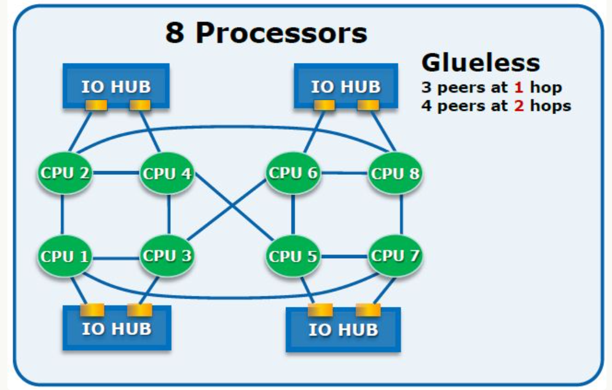
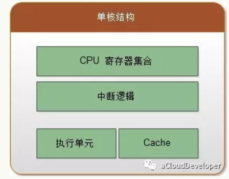
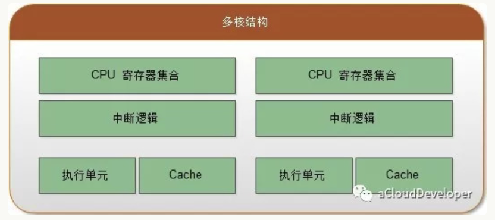
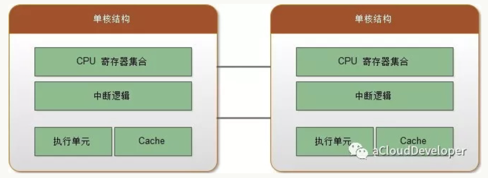
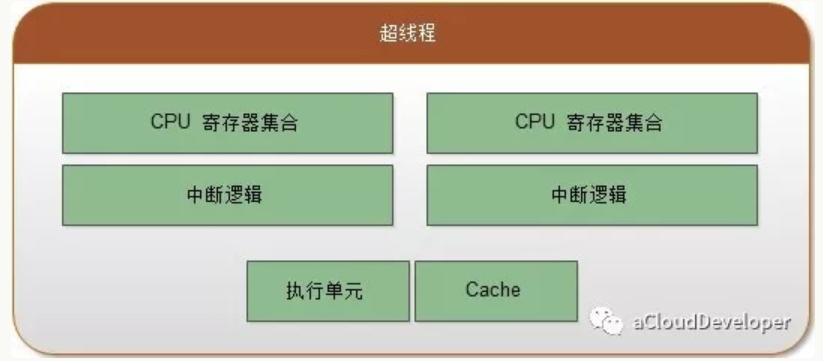
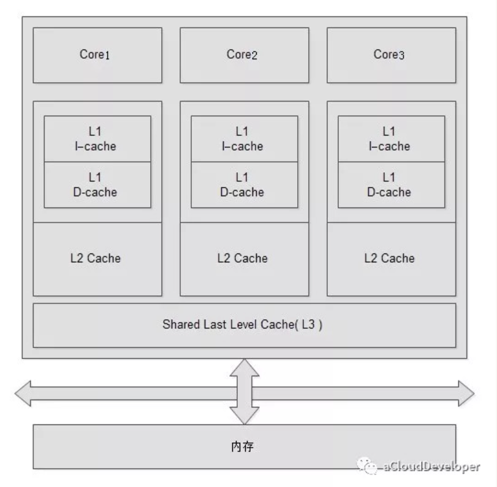
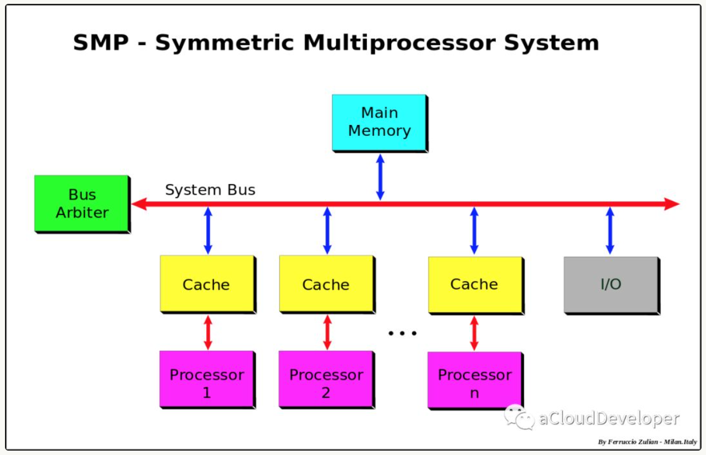
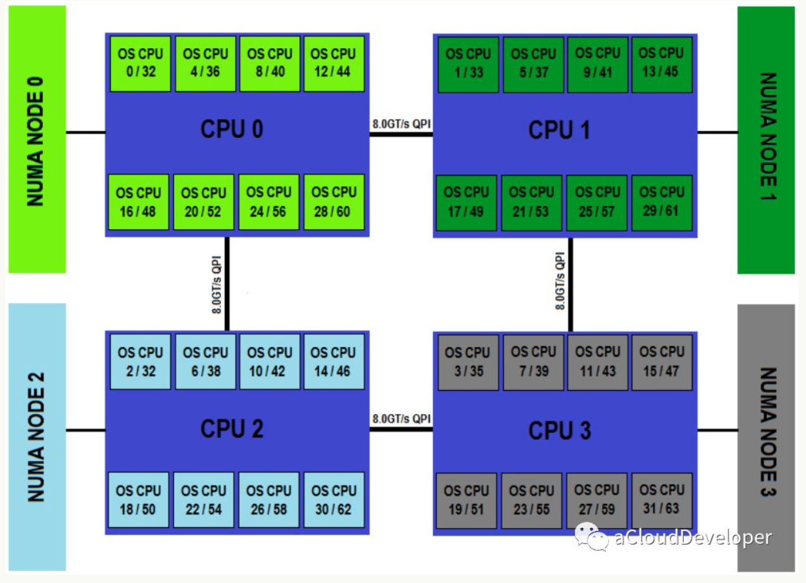
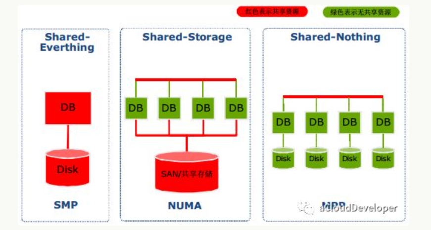

## 前言

随着计算机技术（特别是以芯片为主的硬件技术）的快速发展，CPU 架构逐步从以前的单核时代进阶到如今的多核时代，在多核时代里，多颗 CPU 核心构成了一个小型的“微观世界”。每颗 CPU 各司其职，并与其他 CPU 交互，共同支撑起了一个“物理世界”。从这个意义上来看，我们更愿意称这样的“微观世界”为 CPU 拓扑，就像一个物理网络一样，各个网络节点通过拓扑关系建立起连接来支撑起整个通信系统。

## 单核 or 多核 or 多 CPU or 超线程

在单核时代，为了提升 CPU 的处理能力，普遍的做法是提高 CPU 的主频率，但一味地提高频率对于 CPU 的功耗也是影响很大的（CPU 的功耗正比于主频的三次方）。

另外一种做法是提高 IPC （每个时钟周期内执行的指令条数），这种做法要么是提高指令的并行度，要么是增加核数。显然，后一种方法更具有可扩展性，这也是摩尔定律的必然性。

CPU 的性能到底是如何体现的呢？为了弄清楚这个问题，我们结合单核 CPU 和多核 CPU 的结构来进一步剖析。

首先，对于一个单核结构，即一颗物理 CPU 封装里只集成了一个物理核心，其主要组件可以简化为：CPU 寄存器集合、中断逻辑、执行单元和 Cache，如下图：

对于一个多线程程序，主要通过时间片轮转的方式来获得 CPU 的执行权，从内部来看，这其实是串行执行的，性能自然并不怎么高。

其次，对于多核结构，则是在一颗物理 CPU 封装里集成了多个对等的物理核心，所谓对等，就是每个核心都有相同的内部结构。多个核心之间通过芯片内部总线来完成通信。随着 CPU 制造工艺的提升，每颗 CPU 封装中集成的物理核心也在不断提高。

对于一个多线程程序，这种情况能够实现真正的并发，但线程在不同核之间切换会存在一定的开销，但由于走的是芯片内部总线，开销相对会比较小。

除了上述两种结构，还有另外一种结构是多 CPU 结构，也就是多颗单独封装的 CPU 通过外部总线相连，构成的一个统一的计算平台。每个 CPU 都需要独立的电路支持，有自己的 Cache。它们之间的通信通过主板上的总线来完成。

同样对于一个多线程程序，不同于上一种情况的是，线程间的切换走的是外部总线，延迟较大，开销自然较大，而且对于有共享的数据还会因 Cache 一致性带来一定的开销（关于 Cache 下一小节说明）。

上述结构，一个 CPU 核心同一时间内只能执行一个线程，效率低下，为了提高 CPU 的利用率，CPU 芯片厂商又推出超线程（Hyper-Thread-ing）技术，即让一个物理核心同时执行多个线程，使整体性能得到提升。虽然物理上只有一个核心，但逻辑上被划分了多个逻辑核心，它们之间是完全隔离的。

对于每个逻辑核心，拥有完整独立的寄存器集合和中断逻辑，共享执行单元和 Cache。由于是共享执行单元，所以对高 IPC 的应用，其性能提升有限。

## Cache

Cache 是一种 SRAM （Static Random Access Memory，静态访问随机存储器）。出于成本和生产工艺考虑，一般将 Cache 分为三级。一级（L1）访问速度最快，但是容量最小，一般只有几十 KB；二级（L2）次之，一般有几百 KB 到几 MB 不等，三级（LLC，Last Level Cache）最慢，但是容量也最大，一般有几 MB 到几十 MB。

一级 Cache 又分为数据 Cache 和指令 Cache，顾名思义，数据 Cache 用来存数据，指令 Cache 用来存指令。下图是一个简单的 Cache 系统逻辑示意图。

在多核结构中，每个物理核心都拥有独立的一级 Cache 和二级 Cache，而三级 Cache 是所有核心共享。这种共享需要解决的一个问题是公平地为每个核心分配 Cache 大小，避免 Cache 命中率低的问题。

对于现代计算机系统，说到 Cache，不得不提 TLB（Translation Look-aside Buffer） Cache。简单理解，如果说 Cache 存放的是内存中的内容，那么 TLB Cache 存放的是页表项。

为什么页表项需要用 Cache 存，原因当然是快。你可能觉得用三级 Cache 存就行了，为什么还要专门上 TLB Cache。

这里有两点考虑，一点是 TLB 采用基于内容的访问存储器 CAM，这种存储器能做到根据虚拟地址查询直接返回物理地址，效率极高，不需要像传统方式那样采用多级页表查询。另外一点是 Cache 的“淘汰”机制决定，Cache 会根据算法淘汰掉那些不常使用的内容，这对于页表这种需要频繁访问（每次程序寻址都要访问页表）的特性显然是矛盾的，所以就需要专门为页表提供一种特殊的 Cache，即 TLB Cache。

## SMP or NUMA or MPP?

如果说前面咱们讨论的是 CPU 内部的“微观世界”，那么本节将跳出来，探讨一个系统级的“宏观世界”。

**SMP(Symmetric Multi-Processor)**

MP (Symmetric Multi Processing),对称多处理系统内有许多紧耦合多处理器，在这样的系统中，所有的CPU共享全部资源，如总线，内存和I/O系统等，操作系统或管理数据库的复本只有一个，这种系统有一个最大的特点就是共享所有资源。多个CPU之间没有区别，平等地访问内存、外设、一个操作系统。操作系统管理着一个队列，每个处理器依次处理队列中的进程。如果两个处理器同时请求访问一个资源（例如同一段内存地址），由硬件、软件的锁机制去解决资源争用问题。Access to RAM is serialized; this and cache coherency issues causes performance to lag slightly behind the number of additional processors in the system.

​                                                                                          SMP架构

所谓对称多处理器结构，是指服务器中多个 CPU 对称工作，无主次或从属关系。各 CPU 共享相同的物理内存，每个 CPU 访问内存中的任何地址所需时间是相同的，因此 SMP 也被称为一致存储器访问结构 (UMA ： Uniform Memory Access) 。对 SMP 服务器进行扩展的方式包括增加内存、使用更快的 CPU 、增加 CPU 、扩充 I/O( 槽口数与总线数 ) 以及添加更多的外部设备 ( 通常是磁盘存储 ) 。

SMP 服务器的主要特征是共享，系统中所有资源 (CPU 、内存、 I/O 等 ) 都是共享的。也正是由于这种特征，导致了 SMP 服务器的主要问题，那就是它的扩展能力非常有限。对于 SMP 服务器而言，每一个共享的环节都可能造成 SMP 服务器扩展时的瓶颈，而最受限制的则是内存。由于每个 CPU 必须通过相同的内存总线访问相同的内存资源，因此随着 CPU 数量的增加，内存访问冲突将迅速增加，最终会造成 CPU 资源的浪费，使 CPU 性能的有效性大大降低。实验证明， SMP 服务器 CPU 利用率最好的情况是 2 至 4 个 CPU 。

这种系统由于共享资源，不可避免地要加锁来解决资源竞争的问题，带来一定的性能开销，另外，扩展能力还非常有限，实验证明，SMP 系统最好的情况是有 2-4 个 CPU，适用于 PC、笔记本电脑和小型服务器等。

**NUMA(Non-Uniform Memory Access)**

由于 SMP 在扩展能力上的限制，人们开始探究如何进行有效地扩展从而构建大型系统的技术， NUMA 就是这种努力下的结果之一。利用 NUMA 技术，可以把几十个 CPU( 甚至上百个 CPU) 组合在一个服务器内。

这种结构引入了 CPU 分组的概念，用 Node 来表示，一个 Node 可能包含多个物理 CPU 封装，从而包含多个 CPU 物理核心。每个 Node 有自己独立的资源，包括内存、IO 等。每个 Node 之间可以通过互联模块总线（QPI）进行通信，所以，也就意味着每个 Node 上的 CPU 都可以访问到整个系统中的所有内存，但很显然，访问远端 Node 的内存比访问本地内存要耗时很多，这也是 NUMA 架构的问题所在，我们在基于 NUMA 架构开发上层应用程序要尽可能避免跨 Node 内存访问。

​                                                                                      NUMA架构

NUMA 架构在 SMP 架构的基础上通过分组的方式增强了可扩展性，但从性能上看，随着 CPU 数量的增加，并不能线性增加系统性能，原因就在于跨 Node 内存访问的问题。所以，一般 NUMA 架构最多支持几百个 CPU 就不错了。

但对于很多大型计算密集型的系统来说，NUMA 显然有些吃力，所以，后来又出现了 MPP 架构，即海量并行处理架构。这种架构也有分组的概念，但和 NUMA 不同的是，它不存在异地内存访问的问题，每个分组内的 CPU 都有自己本地的内存、IO，并且不与其他 CPU 共享，是一种完全无共享的架构，因此它的扩展性最好，可以支持多达数千个 CPU 的量级。

## 影响

SMP（对称多处理）和NUMA（非一致内存访问）这两种处理器架构，对编程的影响具体如下：

1. **SMP（对称多处理）:**
   - **编程风格：** SMP系统中多个处理器核心对称地共享系统内存，因此编程方式类似于单核系统。
   - **API/工具：** 使用常见的线程库（如POSIX Threads、OpenMP）进行多线程编程。
   - **考虑事项：** 强调线程同步、互斥锁等，以实现多核心的并行执行。
   - **工具：** 使用`taskset`等工具进行线程亲和性和核心绑定。

2. **NUMA（非一致内存访问）:**
   - **编程风格：** NUMA系统中，不同处理器核心连接到不同的内存节点，内存访问存在非一致性。
   - **API/工具：** 使用NUMA感知的API和工具，如`numa_alloc_onnode`、`numactl`。
   - **考虑事项：** 明确管理内存局部性、线程放置和数据结构，以减少跨节点的内存访问。
   - **工具：** 利用性能分析工具（如`numastat`和`numatop`）监视NUMA效果。

在SMP中，强调多核心对称共享内存，编程方式主要关注多线程和并行化。而在NUMA中，需要关注不同节点的内存访问差异，使用NUMA感知的工具和API进行内存管理和线程放置，以最大程度地减少跨节点的内存访问。总体而言，NUMA的编程方式相对于SMP来说更加复杂，需要更多的考虑内存局部性和数据结构布局。

**参考：**

- [CPU 拓扑：从 SMP 谈到 NUMA （理论篇）](https://ctimbai.github.io/2018/05/03/tech/linux/cpu/CPU%E6%8B%93%E6%89%91%E4%BB%8ESMP%E8%B0%88%E5%88%B0NUMA%EF%BC%88%E7%90%86%E8%AE%BA%E7%AF%87%EF%BC%89/)
- [SMP、NUMA、MPP体系结构介绍](https://www.cnblogs.com/yubo/archive/2010/04/23/1718810.html)
- [NUMA架构的CPU -- 你真的用好了么？](https://cenalulu.github.io/linux/numa/)

