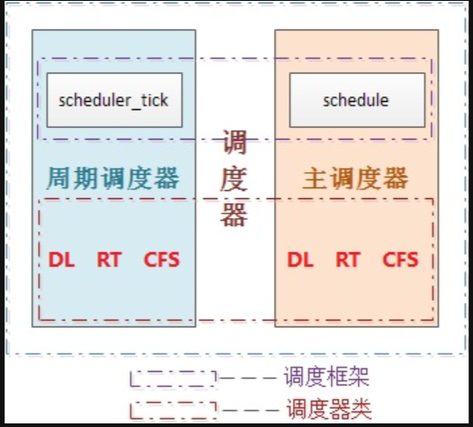
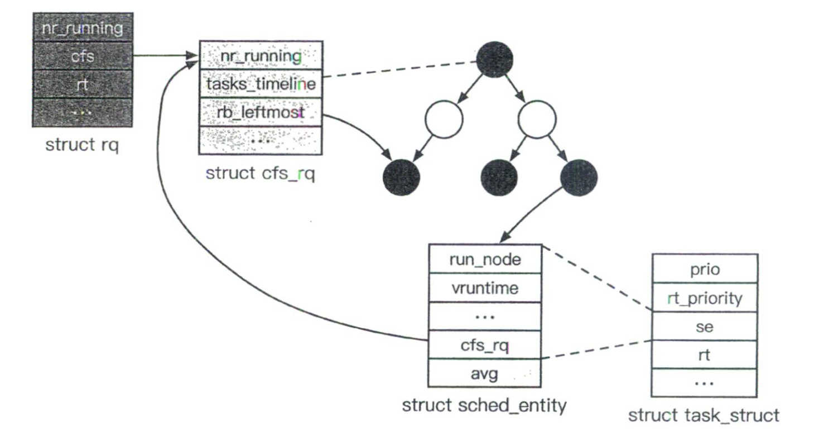

**Linux进程调度**

内存中保存了对每个进程的唯一描述，并通过若干结构与其他进程连接起来。

**调度器**面对的情形就是这样，其任务是在程序之间共享CPU时间，创造并行执行的错觉，该任务分为两个不同部门，其中一个**涉及调度策略**，另一个涉及**上下文切换**。

**此篇引用自博客：[Linux进程调度器概述--Linux进程的管理与调度(十五）](https://kernel.blog.csdn.net/article/details/51699889)**

# 前言

## 什么是调度器

通常来说，操作系统是应用程序和可用资源之间的媒介。

典型的资源有内存和物理设备。但是CPU也可以认为是一个资源，调度器可以临时分配一个任务在上面执行（单位是时间片）。调度器使得我们同时执行多个程序成为可能，因此可以与具有各种需求的用户共享CPU。

内核必须提供一种方法，在各个进程之间尽可能公平地享有CPU时间，而同时又要考虑不同的任务优先级。

调度器的一个重要目标是有效地分配CPU时间片，同时提供很好的用户体验。调度器还需要面对一些互相冲突的目标，例如既要为关键实时任务最小化响应时间，又要最大限度提高CPU的总体利用率。

调度器的一般原理是，按所需分配的计算能力，向系统中每个进程提供最大的公正性，或者从另一个角度说，他试图确保没有进程被亏待。

## 调度策略

传统的类Unix操作系统的调度算法必须实现几个互相冲突的目标：

- 进程响应时间尽可能快
- 后台作业的吞吐量尽可能高
- 尽可能避免进程的饥饿现象
- 低优先级和高优先级进程的需要尽可能调和等等

调度策略（scheduling policy）的任务就是决定什么时候以怎么样的方式选择一个新的进程占用CPU运行。

传统操作系统的调度基于分时（time sharing）技术：多个进程以**时分多路复用**方式运行，因为CPU的时间被分成**时间片**（slice），给每个可运行分配一片CPU时间片，当然单片机在任何给定的时刻只能运行一个进程。

如果当前可运行进程的时限（quantum）到期时（即时间片用尽），而该进程还有运行完毕，进程切换就可以发生。

分时依赖于定时中断，因此对进程是透明的，不需要在承租中插入额外的代码来保证CPU分时。

调度策略也是根据进程的优先级对他们进行分类，有时用复杂算法求出当前进程的优先级，但是最后他们的结果是相同的，每个进程都与一个值（优先级）相关联，这个值表示把进程如何适当地分配给CPU。

在Linux中，进程的优先级是动态的，调度程序跟踪进程正在做什么，并周期性的调正他们的优先级。在这种方式下，在较长的时间间隔内没有任何使用CPU的进程，通过动态地增加他们地优先级来提升他们。相应地，对于已经在CPU上运行了较长长时间的进程，通过减少他们的优先级来处罚他们。

## 进程饥饿

进程饥饿，即为Starvation，指当等待时间给进程推进和响应带来明显影响称为进程饥饿。当饥饿到一定程度的进程在等待到即使完成也无实际意义的时候称为饥饿死亡。

**产生饥饿的主要原因**

在一个动态系统中，对于每类系统资源，即不能保证等待时间上界。在这种情况下，即使系统没有发生死锁，某些进程也可能长时间等待。当等待时间给进程推进和响应带来明显影响时，称发生了进程饥饿，当饥饿到一定程度的进程所赋予的任务即使完成也不再具有实际意义时称该进程被饿死。

举个例子，当有多个进程需要打印文件时，如果系统分配打印机的策略是最短文件优先，那么长文件的打印任务将由于短文件的源源不断到来而被无限期推迟，导致最终的饥饿甚至饿死。

# Linux进程分类

## 进程的分类

当涉及有关调度的问题时，传统上把进程分类为**I/O受限**（I/O-bound）和**CPU受限**（CPU-bound）。

|   类型    |    别称    |                        描述                        |           示例           |
| :-------: | :--------: | :------------------------------------------------: | :----------------------: |
| I/O受限型 | I/O密集型  | 频繁的使用I/O设备, 并花费很多时间等待I/O操作的完成 | 数据库服务器, 文本编辑器 |
| CPU受限型 | 计算密集型 |            花费大量CPU时间进行数值计算             |       图形绘制程序       |

另外一种分类法把进程区分为三类:

|              类型               |                             描述                             |                             示例                             |
| :-----------------------------: | :----------------------------------------------------------: | :----------------------------------------------------------: |
| 交互式进程(interactive process) | 此类进程经常与用户进行交互, 因此需要花费很多时间等待键盘和鼠标操作. 当接受了用户的输入后, 进程必须很快被唤醒, 否则用户会感觉系统反应迟钝 |              shell, 文本编辑程序和图形应用程序               |
|    批处理进程(batch process)    | 此类进程不必与用户交互, 因此经常在后台运行. 因为这样的进程不必很快相应, 因此常受到调度程序的怠慢 |        程序语言的编译程序, 数据库搜索引擎以及科学计算        |
|   实时进程(real-time process)   | 这些进程由很强的调度需要, 这样的进程绝不会被低优先级的进程阻塞. 并且他们的响应时间要尽可能的短 | 视频音频应用程序, 机器人控制程序以及从物理传感器上收集数据的程序 |

**注意**

前面的两类分类方法在一定程序上相互独立。例如, 一个批处理进程很有可能是I/O受限的(如数据库服务器), 也可能是CPU受限的(比如图形绘制程序) 。

## 实时进程与普通进程

在Linux中，调度算法可以明确的确认所有实时进程的身份，但是没有办法区分交互式程序和批处理程序（统称普通进程），Linux2.6的调度程序实现了基于进程过去行为的启发式算法，以确定进程应该被当做交互式还是批处理。当然与批处理相比，调度算法有偏爱交互式进程的倾向。

根据进程的不同分类Linux采用不同的调度策略。

对于实时进程，采用**FIFO**或者**Round Robin**（RR）的调度策略。

对于普通进程，则需要区分交互式和批处理的不同。传统Linux调度器提高交互式应用的优先级，使得它们能更快地被调度。而CFS和RSDL等新的调度器地核心思想是**完全公平**。这个设计理念不仅大大简化了调度器地代码复杂度，还对各种调度需求提供了更完美地的支持。

注意Linux通过将进程和进程视为同一个，同时包含二者。进程可以看作是单个线程，但是进程可以包含共享一定资源（代码/数据）的多个线程。因此进程调度也包含了线程调度的功能。

Linux进程的调度算法其实经过了很多次的演变，但是其演变主要是针对与普通进程的。因为前面我们提到过根据进程的不同分类Linux采用不同的调度策略。实时进程和普通进程采用了不同的调度策略，更是一般的普通进程还需要启发式的识别批处理进程和交互式进程。

实时进程的调度策略比较简单，因为实时进程只要求尽可能的被响应，基于优先级，每个进程根据它重要程度的不同被赋予不同的优先级，调度器在每次调度时，总选择优先级最高的进程开始执行。低优先级不可能抢占高优先级。因此FIFO或者Round Robin的调度策略即可满足实时进程调度的需求。

但是普通进程的调度策略就比较麻烦了，因为普通进程不能简单的只看优先级，必须公平的占有CPU，否则很容易出现进程饥饿，这种情况下用户会感觉操作系统很卡，响应很慢。

此外如果进程中存在实时进程，则实时进程总是在普通进程之前被调度。

# Linux调度器的演变

一开始的调度器是复杂度为**O(n)的调度算法**（实际上会遍历所有任务，所以复杂度为O(n)）,这个算法的缺点是当内核中有很多任务时，调度器本身就会耗费不少时间，所以，从Linux2.5开始引入赫赫有名的**O(1)调度器**。

然而，linux是集全球很多程序员的聪明才智而发展起来的超级内核，没有最好，只有更好，在O(1)调度器风光了没几天就又被另一个更优秀的调度器取代了，它就是**CFS调度器**Completely Fair Scheduler. 这个也是在2.6内核中引入的，具体为2.6.23，即从此版本开始，内核使用CFS作为它的默认调度器，O(1)调度器被抛弃了, 其实CFS的发展也是经历了很多阶段，最早期的楼梯算法(SD), 后来逐步对SD算法进行改进出RSDL(Rotating Staircase Deadline Scheduler), 这个算法已经是”完全公平”的雏形了， 直至CFS是最终被内核采纳的调度器, 它从RSDL/SD中吸取了完全公平的思想，不再跟踪进程的睡眠时间，也不再企图区分交互式进程。它将所有的进程都统一对待，这就是公平的含义。CFS的算法和实现都相当简单，众多的测试表明其性能也非常优越

| 字段             | 版本           |
| ---------------- | -------------- |
| O(n)的始调度算法 | linux-0.11~2.4 |
| O(1)调度器       | linux-2.5      |
| CFS调度器        | linux-2.6~至今 |

```plain text
更多CFS的信息, 请参照
http://www.ibm.com/developerworks/cn/linux/l-completely-fair-scheduler/index.html?ca=drs-cn-0125
另外内核文档sched-design-CFS.txt中也有介绍

关于调度器发展的详细内容, 可以阅读Linux进程调度策略的发展和演变–Linux进程的管理与调度(十六)
http://blog.csdn.net/gatieme/article/details/51701149
```

# Linux的调度器设计

## Linux进程调度器的框架

**2个调度器**

可以用两种方法来激活调度：

- 一种是直接的，比如进程进入睡眠或者处于其他原因放弃CPU
- 另一种是通过周期性的机制，以固定频率的运行，不时的检测是否有必要

因此Linux的调度器由两个调度器组成：**主调度器，周期性调度器**（两者又统称为通用调度器（**generic scheduler**）和**核心调度器（core scheduler**））。

并且每个调度器包括两个内容：**调度框架**（其实就是两个函数框架）及**调度器类**。

**6种调度策略**

Linux内核目前实现了6中调度策略(即调度算法), 用于对不同类型的进程进行调度, 或者支持某些特殊的功能

比如**SCHED_NORMAL（POSIX中称SCHED_OTHER）**和**SCHED_BATCH**调度普通的非实时进程, **SCHED_FIFO**和**SCHED_RR**和**SCHED_DEADLINE**则采用不同的调度策略调度实时进程, **SCHED_IDLE**则在系统空闲时调用idle进程.

```plain text
idle的运行时机
idle 进程优先级为MAX_PRIO，即最低优先级。
早先版本中，idle是参与调度的，所以将其优先级设为最低，当没有其他进程可以运行时，才会调度执行 idle
而目前的版本中idle并不在运行队列中参与调度，而是在cpu全局运行队列rq中含idle指针，指向idle进程, 在调度器发现运行队列为空的时候运行, 调入运行
```

|      字段      |                             描述                             | 所在调度器类 |
| :------------: | :----------------------------------------------------------: | :----------: |
|  SCHED_NORMAL  | （也叫SCHED_OTHER）用于普通进程，通过CFS调度器实现。SCHED_BATCH用于非交互的处理器消耗型进程。SCHED_IDLE是在系统负载很低时使用 |     CFS      |
|  SCHED_BATCH   | SCHED_NORMAL普通进程策略的分化版本。采用分时策略，根据动态优先级(可用nice()API设置），分配CPU运算资源。注意：这类进程比上述两类实时进程优先级低，换言之，在有实时进程存在时，实时进程优先调度。但针对吞吐量优化, 除了不能抢占外与常规任务一样，允许任务运行更长时间，更好地使用高速缓存，适合于成批处理的工作 |     CFS      |
|   SCHED_IDLE   | 优先级最低，在系统空闲时才跑这类进程(如利用闲散计算机资源跑地外文明搜索，蛋白质结构分析等任务，是此调度策略的适用者） |   CFS-IDLE   |
|   SCHED_FIFO   | 先入先出调度算法（实时调度策略），相同优先级的任务先到先服务，高优先级的任务可以抢占低优先级的任务 |      RT      |
|    SCHED_RR    | 轮流调度算法（实时调度策略），后者提供 Roound-Robin 语义，采用时间片，相同优先级的任务当用完时间片会被放到队列尾部，以保证公平性，同样，高优先级的任务可以抢占低优先级的任务。不同要求的实时任务可以根据需要用sched_setscheduler() API设置策略 |      RT      |
| SCHED_DEADLINE | 新支持的实时进程调度策略，针对突发型计算，且对延迟和完成时间高度敏感的任务适用。基于Earliest Deadline First (EDF) 调度算法 |      DL      |

linux内核实现的6种调度策略, 前面三种策略使用的是cfs调度器类，后面两种使用rt调度器类, 最后一个使用DL调度器类。

**5个调度器类**

而依据其调度策略的不同实现了5个调度器类, 一个调度器类可以用一种种或者多种调度策略调度某一类进程, 也可以用于特殊情况或者调度特殊功能的进程。

|     调度器类     |                             描述                             |       对应调度策略        |
| :--------------: | :----------------------------------------------------------: | :-----------------------: |
| stop_sched_class | 优先级最高的线程，会中断所有其他线程，且不会被其他任务打断作用1.发生在cpu_stop_cpu_callback 进行cpu之间任务migration2.HOTPLUG_CPU的情况下关闭任务 |  无, 不需要调度普通进程   |
|  dl_sched_class  |           采用EDF最早截至时间优先算法调度实时进程            |      SCHED_DEADLINE       |
|  rt_sched_class  | 采用提供 Roound-Robin算法或者FIFO算法调度实时进程具体调度策略由进程的task_struct->policy指定 |   SCHED_FIFO, SCHED_RR    |
|  air_sched_clas  |               采用CFS算法调度普通的非实时进程                | SCHED_NORMAL, SCHED_BATCH |
| idle_sched_class | 采用CFS算法调度idle进程, 每个cup的第一个pid=0线程：swapper，是一个静态线程。调度类属于：idel_sched_class，所以在ps里面是看不到的。一般运行在开机过程和cpu异常的时候做dump |        SCHED_IDLE         |

其所属进程的优先级顺序为

```plain text
stop_sched_class -> dl_sched_class -> rt_sched_class -> fair_sched_class -> idle_sched_class
```

**3个调度实体**

调度器不限于调度进程, 还可以调度更大的实体, 比如实现组调度: 可用的CPUI时间首先在一半的进程组(比如, 所有进程按照所有者分组)之间分配, 接下来分配的时间再在组内进行二次分配。

这种一般性要求调度器不直接操作进程, 而是处理可调度实体, 因此需要一个通用的数据结构描述这个调度实体,即seched_entity结构, 其实际上就代表了一个调度对象，可以为一个进程，也可以为一个进程组。

linux中针对当前可调度的实时和非实时进程, 定义了类型为seched_entity的3个调度实体。

|    调度实体     |       名称       |                      描述                      |    对用调度器    |
| :-------------: | :--------------: | :--------------------------------------------: | :--------------: |
| sched_dl_entity | DEADLINE调度实体 |         采用EDF算法调度的实时调度实体          |  dl_sched_class  |
| sched_rt_entity |    RT调度实体    | 采用Roound-Robin或者FIFO算法调度的实时调度实体 |  rt_sched_class  |
|  sched_entity   |   CFS调度实体    |   采用CFS算法调度的普通非实时进程的调度实体    | fair_sched_class |

**调度器类的就绪队列**

另外，对于调度框架及调度器类，它们都有自己管理的运行队列，调度框架只识别rq（其实它也不能算是运行队列），而对于cfs调度器类它的运行队列则是cfs_rq（内部使用红黑树组织调度实体），实时rt的运行队列则为rt_rq（内部使用优先级bitmap+双向链表组织调度实体）, 此外内核对新增的dl实时调度策略也提供了运行队列dl_rq。

**调度器整体框架**

本质上, 通用调度器(核心调度器)是一个分配器,与其他两个组件交互。

调度器用于判断接下来运行哪个进程。

- 内核支持不同的调度策略(完全公平调度, 实时调度, 在无事可做的时候调度空闲进程,即0号进程也叫swapper进程,idle进程), 调度类使得能够以模块化的方法实现这些侧露额, 即一个类的代码不需要与其他类的代码交互当调度器被调用时, 他会查询调度器类, 得知接下来运行哪个进程。
- 在选中将要运行的进程之后, 必须执行底层的任务切换。这需要与CPU的紧密交互. 每个进程刚好属于某一调度类, 各个调度类负责管理所属的进程. 通用调度器自身不涉及进程管理, 其工作都委托给调度器类。

每个进程都属于某个调度器类(由字段task_struct->sched_class标识), 由调度器类采用进程对应的调度策略调度(由task_struct->policy )进行调度, task_struct也存储了其对应的调度实体标识。



​                                                                                     Linux调度器框架图



​                                                                                        CFS运行示意图

## 进程的调度

首先，我们需要清楚，什么样的进程会进入调度器进行选择，就是处于TASK_RUNNING状态的进程，而其他状态下的进程都不会进入调度器进行调度。
系统发生调度的时机如下：

- 调用cond_resched()时
- 显示调用schedule()时
- 从系统调用或者异常中断返回用户空间时
- 从中断上下文返回用户空间时

当开启内核抢占（默认开启）时，会多出几个调度时机，如下：

- 在系统调用或者异常中断上下文调用preempt_enable()时（多次调用preempt_enable()时，系统只会在最后一次调用时调度）
- 在中断上下文中，从中断处理函数返回到可抢占的上下文时（这里是中断下半段，中断上半部实际上会关闭中断，而新的中断只会被登记，由于上半部处理很快，上半部处理完成后才会执行新的中断信号，这样就i形成了中断可重入）

而在系统启动调度器初始化时会初始化一个调度定时器，调度定时器每隔一定时间执行一个中断，该中断会对当前运行进程运行时间进行更新，如果进程需要被调度，在调度定时器中断中会设置一个调度标志位，之后从定时器中断返回，因为上面已经提到从中断上下文返回时是有调度时机的，在内核源码的汇编代码中所有中断返回处理都必须去判断调度标志位是否设置，如设置则执行schedule()进行调度。

而我们知道实时进程和普通进程是共存的，调度器是怎么协调它们之间的调度的呢，其实很简单，每次调度时，会先在实时进程运行队列中查看是否有可运行的实时进程，如果没有，再去普通进程运行队列找下一个可运行的普通进程，如果也没有，则调度器会使用idle进程进行运行。

系统并不是每时每刻都允许调度的发生，当处于硬中断期间的时候，调度是被系统禁止的，之后硬中断过后才重新允许调度。而对于异常，系统并不会禁止调度，也就是在异常上下文中，系统是有可能发生调度的。

## 抢占标识TIF_NEED_RESCHED

内核在检查need_resched标识TIF_NEED_RESCHED的值判断是否需要抢占当前进程, 内核在thread_info的flag中设置了一个标识来标志进程是否需要重新调度, 即重新调度need_resched标识TIF_NEED_RESCHED, 内核在即将返回用户空间时会检查标识TIF_NEED_RESCHED标志进程是否需要重新调度。

系统中每个进程都有一个特定于体系结构的struct thread_info结构, 用户层程序被调度的时候会检查struct thread_info中的need_resched标识TIF_NEED_RESCHED标识来检查自己是否需要被重新调度。

如果内核检查进程的抢占标识被设置, 则会在一个关键的时刻, 调用调度器来完成调度和抢占的工作。

## 内核抢占和用户抢占

而根据进程抢占发生的时机, 抢占可以分为内核抢占和用户抢占, **内核抢占**就是指一个在内核态运行的进程, 可能在执行内核函数期间被另一个进程抢占。

一般来说，用户抢占发生几下情况：

- 从系统调用返回用户空间；
- 从中断(异常)处理程序返回用户空间

内核抢占发生的时机，一般发生在：

- 当从中断处理程序正在执行，且返回内核空间之前。当一个中断处理例程退出，在返回到内核态时(kernel-space)。这是隐式的调用schedule()函数，当前任务没有主动放弃CPU使用权，而是被剥夺了CPU使用权。
- 当内核代码再一次具有可抢占性的时候，如解锁（spin_unlock_bh）及使能软中断(local_bh_enable)等, 此时当kernel code从不可抢占状态变为可抢占状态时(preemptible again)。也就是preempt_count从正整数变为0时。这也是隐式的调用schedule()函数
- 如果内核中的任务显式的调用schedule(), 任务主动放弃CPU使用权
- 如果内核中的任务阻塞(这同样也会导致调用schedule()), 导致需要调用schedule()函数。任务主动放弃CPU使用权

内核抢占采用同抢占标识的类似方法被实现, linux内核在thread_info结构中添加了一个自旋锁标识preempt_count, 称为抢占计数器(preemption counter)。

```c
struct thread_info
{
    /*  ......  */
    int preempt_count;   /* 0 => preemptable, <0 => BUG */
    /*  ......  */
}
```

| preempt_count值 |                          描述                           |
| :-------------: | :-----------------------------------------------------: |
|       >0        | 禁止内核抢占, 其值标记了使用preempt_count的临界区的数目 |
|       =0        |                      开启内核抢占                       |
|       <0        |                 锁为负值, 内核出现错误                  |

内核自然也提供了一些函数或者宏, 用来开启, 关闭以及检测抢占计数器preempt_coun的值, 这些通用的函数定义在include/asm-generic/preempt.h, 而某些架构也定义了自己的接口， 比如x86架构[/arch/x86/include/asm/preempt.h](http://lxr.free-electrons.com/source/arch/x86/include/asm/preempt.h?v=4.6)。

**详细内容请参见 [Linux用户抢占和内核抢占详解(概念, 实现和触发时机)–Linux进程的管理与调度(二十）](http://blog.csdn.net/gatieme/article/details/51872618)**

## 周期性调度器scheduler_tick

**周期调度器**

周期性调度器scheduler_tick由内核时钟中断周期性的触发, 周期性调度器以固定的频率激活负责当前进程调度类的周期性调度方法, 以保证系统的并发性, 周期性调度器通过调用进程所属调度器类的task_tick操作完成周期性调度的通知和配置工作, 通过resched_curr函数(早期的resched_task函数)设置抢占标识TIF_NEED_RESCHED来通知内核在必要的时间由主调度函数完成真正的调度工作, 此种做法称之为延迟调度策略。

**关于周期性调度器的详细信息, 参见[Linux核心调度器之周期性调度器scheduler_tick–Linux进程的管理与调度(十八）](http://blog.csdn.net/gatieme/article/details/51872561)**

## 主调度器schedule

**主调度器**

schedule就是主调度器的工作函数, 在内核中的许多地方, 如果要将CPU分配给与当前活动进程不同的另一个进程, 都会直接调用主调度器函数schedule或者其子函数__schedule。

**__schedule**

- 完成一些必要的检查, 并设置进程状态, 处理进程所在的就绪队列
- 调度全局的pick_next_task选择抢占的进程
- 如果当前cpu上所有的进程都是cfs调度的普通非实时进程, 则直接用cfs调度, 如果无程序可调度则调度idle进程。否则从优先级最高的调度器类sched_class_highest(目前是stop_sched_class)开始依次遍历所有调度器类的pick_next_task函数, 选择最优的那个进程执行。
- context_switch完成进程上下文切换。调用switch_mm(), 把虚拟内存从一个进程映射切换到新进程中。调用switch_to()，从上一个进程的处理器状态切换到新进程的处理器状态。这包括保存、恢复栈信息和寄存器信息。

**主调度器的详细信息, 可以参考 [Linux进程核心调度器之主调度器–Linux进程的管理与调度(十九）](http://blog.csdn.net/gatieme/article/details/51872594)**

## 进程上下文切换context_switch

**context_switch流程**

context_switch其实是一个分配器, 他会调用所需的特定体系结构的方法：

- 调用switch_mm(), 把虚拟内存从一个进程映射切换到新进程中
- switch_mm更换通过task_struct->mm描述的内存管理上下文, 该工作的细节取决于处理器, 主要包括加载页表, 刷出地址转换后备缓冲器(部分或者全部), 向内存管理单元(MMU)提供新的信息
- 调用switch_to(), 从上一个进程的处理器状态切换到新进程的处理器状态。这包括保存、恢复栈信息和寄存器信息
- switch_to切换处理器寄存器的内容和内核栈(虚拟地址空间的用户部分已经通过switch_mm变更, 其中也包括了用户状态下的栈, 因此switch_to不需要变更用户栈, 只需变更内核栈), 此段代码严重依赖于体系结构, 且代码通常都是用汇编语言编写

**参见xv6-scheduling**

**为什么switch_to需要3个参数**

在下一个进程被选中执行时, 内核恢复到进程被切换出去的点继续执行, 此时内核只知道谁之前将正在执行的进程抢占了（当前进程）, 但是却不知道当前进程是抢占了谁, 因此底层的进程切换机制必须将此前执行的进程(即当前进程抢占的那个进程)提供给context_switch. 由于控制流会回到函数的该中间, 因此无法通过普通函数的返回值来完成. 因此使用了一个3个参数, 但是逻辑效果是相同的, 仿佛是switch_to是带有两个参数的函数, 而且返回了一个指向此前运行的进程的指针。

```c
switch_to(prev, next, last);

prev = last = switch_to(prev, next);
```

其中返回的prev值并不是做参数的prev值, 而是被当前进程（prev）抢占掉的前一个进程（last）。

**详情请参见, [Linux进程上下文切换过程context_switch详解–Linux进程的管理与调度(二十一）](http://blog.csdn.net/gatieme/article/details/51872659)**

## 处理进程优先级

内核使用一些简单的数值范围0~139表示内部优先级, 数值越低, 优先级越高。

从0~99的范围专供实时进程使用, nice的值[-20,19]则映射到范围100~139。


其中task_struct采用了三个成员表示进程的优先级:prio和normal_prio表示动态优先级, static_prio表示进程的静态优先级。

此外还用了一个字段rt_priority保存了实时进程的优先级。

|    字段     |                             描述                             |
| :---------: | :----------------------------------------------------------: |
| static_prio | 用于保存静态优先级, 是进程启动时分配的优先级, ，可以通过nice和sched_setscheduler系统调用来进行修改, 否则在进程运行期间会一直保持恒定 |
|    prio     |                     保存进程的动态优先级                     |
| normal_prio | 表示基于进程的静态优先级static_prio和调度策略计算出的优先级. 因此即使普通进程和实时进程具有相同的静态优先级, 其普通优先级也是不同的, 进程分叉(fork)时, 子进程会继承父进程的普通优先级 |
| rt_priority | 用于保存实时优先级, 实时进程的优先级用实时优先级rt_priority来表示 |

静态优先级static_prio(普通进程)和实时优先级rt_priority(实时进程)是计算的起点。

因此他们也是进程创建的时候设定好的, 我们通过nice修改的就是普通进程的静态优先级static_prio。

首先通过静态优先级static_prio计算出普通优先级normal_prio, 该工作可以由nromal_prio来完成, 该函数定义在kernel/sched/core.c#L861。

内核通过effective_prio设置动态优先级prio, 计算动态优先级的流程如下：

- 设置进程的普通优先级(实时进程99-rt_priority, 普通进程为static_priority)
- 计算进程的动态优先级(实时进程则维持动态优先级的prio不变, 普通进程的动态优先级即为其普通优先级)

最后, 我们综述一下在针对不同类型进程的计算结果：

|       进程类型       | 实时优先级rt_prority | 静态优先级static_prio |   普通优先级normal_prio   | 动态优先级prio |
| :------------------: | :------------------: | :-------------------: | :-----------------------: | :------------: |
|  EDF调度的实时进程   |     rt_priority      |        不使用         |       MAX_DL_PRIO-1       | 维持原prio不变 |
| RT算法调度的实时进程 |     rt_priority      |        不使用         | MAX_RT_PRIO-1-rt_priority | 维持原prio不变 |
|       普通进程       |        不使用        |      static_prio      |        static_prio        |  static_prio   |
| 优先级提高的普通进程 |        不使用        |   static_prio(改变)   |        static_prio        | 维持原prio不变 |

**关于进程优先级的详细信息请参见[Linux进程优先级的处理–Linux进程的管理与调度(二十二)](http://blog.csdn.net/gatieme/article/details/51719208)**

## 唤醒抢占

当在try_to_wake_up/wake_up_process和wake_up_new_task中唤醒进程时, 内核使用全局check_preempt_curr看看是否进程可以抢占当前进程。

每个调度器类都因应该实现一个check_preempt_curr函数, 在全局check_preempt_curr中会调用进程其所属调度器类check_preempt_curr进行抢占检查, 对于完全公平调度器CFS处理的进程, 则对应由check_preempt_wakeup函数执行该策略。

新唤醒的进程不必一定由完全公平调度器处理, 如果新进程是一个实时进程, 则会立即请求调度, 因为实时进程优先极高, 实时进程总会抢占CFS进程。

**参见[Linux唤醒抢占—-Linux进程的管理与调度(二十三）](http://blog.csdn.net/gatieme/article/details/51872831)**

内核为了实现完全公平, 对一些交互式进程有补偿机制, 这些交互式进程多数情况下属于睡眠状态, 只有在接收到信号以后被唤醒, 比如vim在接收了键盘录入的信号后被唤醒, 完成工作后又进入睡眠态, 因此我们需要对唤醒的进程做一些补偿, 关于补偿的内容我们会在各个调度器类的设计中讲解。
