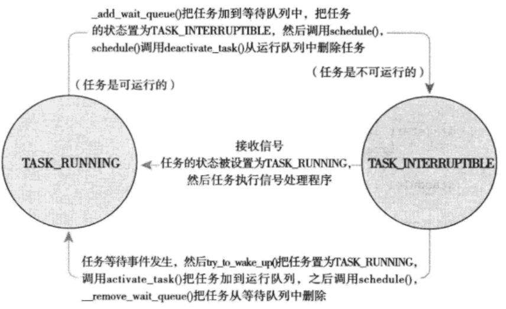

**CFS-绝对公平调度器**

CFS负责处理普通非实时进程, 这类进程是我们linux中最普遍的进程。CFS调度算法的思想：理想状态下每个进程都能获得相同的时间片，并且同时运行在CPU上，但实际上一个CPU同一时刻运行的进程只能有一个。 也就是说，当一个进程占用CPU时，其他进程就必须等待。CFS为了实现公平，必须惩罚当前正在运行的进程，以使那些正在等待的进程下次被调度。

# 前景回顾

**CFS调度器**

Linux内核使用CFS是来调度我们最常见的普通进程, 其所属调度器类为fair_sched_class, 使用的调度策略包括SCHED_NORMAL和SCHED_BATCH, 进程task_struct中struct sched_entity se;字段标识的就是CFS调度器类的调度实体。

**虚拟时间**

具体实现时，CFS通过每个进程的虚拟运行时间（vruntime）来衡量哪个进程最值得被调度。

CFS中的就绪队列是一棵以vruntime为键值的红黑树，虚拟时间越小的进程越靠近整个红黑树的最左端。因此，调度器每次选择位于红黑树最左端的那个进程，该进程的vruntime最小

虚拟运行时间是通过进程的实际运行时间和进程的权重（weight）计算出来的。

在CFS调度器中，将进程优先级这个概念弱化，而是强调进程的权重。一个进程的权重越大，则说明这个进程更需要运行，因此它的虚拟运行时间就越小，这样被调度的机会就越大。
那么，在用户态进程的优先级nice值与CFS调度器中的权重又有什么关系？在内核中通过prio_to_weight数组进行nice值和权重的转换。

完全公平调度算法CFS依赖于虚拟时钟, 用以度量等待进程在完全公平系统中所能得到的CPU时间. 但是数据结构中任何地方都没有找到虚拟时钟. 这个是由于所有的必要信息都可以根据现存的实际时钟和每个进程相关的负荷权重推算出来。

假设现在系统有A，B，C三个进程，A.weight=1,B.weight=2,C.weight=3.那么我们可以计算出整个公平调度队列的总权重是cfs_rq.weight = 6，很自然的想法就是，公平就是你在重量中占的比重的多少来拍你的重要性，那么，A的重要性就是1/6,同理，B和C的重要性分别是2/6,3/6.很显然C最重要就应改被先调度，而且占用的资源也应该最多，即假设A，B,C运行一遍的总时间假设是6个时间单位的话，A占1个单位，B占2个单位，C占三个单位。这就是CFS的公平策略。

CFS调度算法的思想：理想状态下每个进程都能获得相同的时间片，并且同时运行在CPU上，但实际上一个CPU同一时刻运行的进程只能有一个。也就是说，当一个进程占用CPU时，其他进程就必须等待。CFS为了实现公平，必须惩罚当前正在运行的进程，以使那些正在等待的进程下次被调度。

具体实现时，CFS通过每个进程的虚拟运行时间(vruntime)来衡量哪个进程最值得被调度. CFS中的就绪队列是一棵以vruntime为键值的红黑树，虚拟时间越小的进程越靠近整个红黑树的最左端。因此，调度器每次选择位于红黑树最左端的那个进程，该进程的vruntime最小。

虚拟运行时间是通过进程的实际运行时间和进程的权重(weight)计算出来的。在CFS调度器中，将进程优先级这个概念弱化，而是强调进程的权重。一个进程的权重越大，则说明这个进程更需要运行，因此它的虚拟运行时间就越小，这样被调度的机会就越大。而，CFS调度器中的权重在内核是对用户态进程的优先级nice值, 通过prio_to_weight数组进行nice值和权重的转换而计算出来的。


**我们现在具体探索CFS是如何得以实现的。其相关代码位于kernel/sched_fair.c中。我们将特别关注四个组成部分：**

- **时间记账**
- **进程选择**
- **调度器入口**
- **睡眠和唤醒**


# 时间记账

所有调度器都必须对进程运行时间做记账。

## 调度器实体结构

CFS不再有时间片的概念，但是它也必须维护每个进程的时间记账，因为它需要确保每个进程只在公平分配给它的处理器时间内运行。CFS使用调度器实体结构（定义在文件<linux/sched.h>的struct_sched_entity中）来追踪记账：

```c
struct sched_entity
{
    struct load_weight      load;           /* for load-balancing负荷权重，这个决定了进程在CPU上的运行时间和被调度次数 */
    struct rb_node          run_node;
    unsigned int            on_rq;          /*  是否在就绪队列上  */

    u64                     exec_start;         /*  上次启动的时间*/

    u64                     sum_exec_runtime;
    u64                     vruntime;
    u64                     prev_sum_exec_runtime;
    /* rq on which this entity is (to be) queued: */
    struct cfs_rq           *cfs_rq;
    ...
};
```
sum_exec_runtime是用于记录该进程的CPU消耗时间，这个是真实的CPU消耗时间。在进程撤销时会将sum_exec_runtime保存到prev_sum_exec_runtime中。

vruntime是本进程生命周期中在CPU上运行的虚拟时钟。那么何时应该更新这些时间呢?这是通过调用update_curr实现的, 该函数在多处调用。

调度器实体结构作为一个名为se的成员变量，嵌入在进程描述符struct task_struct内。

## 虚拟时间

vruntime变量存放进程的虚拟运行时间，该运行时间（花在运行上的时间和）的计算是经过了所有可运行进程总数的标准化（或者说被加权）。虚拟时间是以ns为单位的，所以vruntime和定时器节拍不再相关。虚拟运行时间可以帮助我们逼近CFS模型所追求的“理想任务处理器”。CFS使用vruntime变量来记录一个程序到底运行了多长时间以及它还应该再运行多久。

定义再kernel/sched_fair.c文件中的update_curr()函数实现了该记账功能。update_curr的流程如下

- 首先计算进程当前时间与上次启动时间的差值
- 通过负荷权重和当前时间模拟出进程的虚拟运行时钟
- 重新设置cfs的min_vruntime保持其单调性

```c
static void update_curr(struct cfs_rq *cfs_rq)
{
    /*  确定就绪队列的当前执行进程curr  */
    struct sched_entity *curr =  cfs_rq->curr;
    u64 now = rq_of(cfs_rq)->clock;
    unsigned long delta_exec;
    
    /*   如果就队列上没有进程在执行, 则显然无事可做  */
    if (unlikely(!curr))
        return;
    /* 获取从最后一次修改负载后当前任务所占用的运行总时间（在32位系统上这不会溢出）
    */
    delta_exec = (unsigned long)(now - curr->exec_start);
    if (!delta_exec)
        return;
    __update_curr(cfs_rq, curr, delta_exec);
    /*  重新更新启动时间exec_start为now  */
    curr->exec_start = now;
    
    if (entity_is_task(curr)) {
        struct task_struct *curtask = task_of(curr);
        trace_sched_stat_runtime(curtask, delta_exec, curr->vruntime);
        cpuacct_change(curtask, delta_exec);
        account_group_exec_runtime(curtask, delta_exec);
    }
}
```

update_curr()计算了当前进程的执行时间，并且将其存放在变量delta_exec中。然后它又将运行时间传递给了__update_curr()，由后者再根据当前可运行进程总数对运行时间进行加权计算。最终将上述的权重值与当前运行进程的vruntime相加。

```c
/***
 * 更新当前任务的运行时统计数据。跳过不在调度类中的当前任务
 */
static inline void
__update_curr(struct cfs_rq *cfs_rq, struct sched_entity *curr,
             unsigned long delta_exec)
{
    unsigned long delta_exec_weighted;
    
    schedstat_set(curr->exec_max, max((u64)delta_exec, curr->exec_max));
    
    /*  将时间差加到先前统计的时间即可  */
    curr->sum_exec_runtime += delta_exec;
    schedstat_add(cfs_rq, exec_clock, delta_exec);
    delta_exec_weighted = calc_delta_fair(delta_exec, curr);
    
    curr->vruntime += delta_exec_weighted;
    update_min_vruntime(cfs_rq);
}
```

update_curr()是由系统定时器周期性调用的，无论是在进程处于可运行态，还是被堵塞处于不可运行态。根据这种方式，vruntime可以准确地测量给定进程地运行时间，而且还可以知道谁应该是下一个被运行地进程。

# 进程选择

在前面的内容中我们提到若存在一个完美的多任务处理器，所有可运行进程的vruntime值将一致。但事实上我们没有找到完美的多任务处理器，因此CFS试图利用一个简单的规则去均衡进程的虚拟运行时间：当CFS需要选择下一个运行进程时，它会挑一个具有最小vruntime的进程。这其实就是CFS调度算法的核心：选择具有最小vruntime的任务。接下来将讨论如何实现选择具有最小vruntime值的进程。

CFS使用红黑树来组织可运行进程队列，并利用其迅速找到最小vruntime值的进程。在Linux中，红黑树称为rbtree，是自平衡树，其插入和查询的时间复杂度均为O(logN)。

## 挑选下一个任务

我们先假设，有那么一个红黑树存储了系统中所有的可运行进程，其中节点的键值便是可运行进程的虚拟时间。稍后再来讨论怎样生成该树，现在先假设我们已经拥有它了。CFS调度器选取待运行的下一个进程，是所有进程中vruntime最小的那个，它对应的便是在树中最左侧的叶子节点。实现这一过程的函数是__pick_next_entity()，它定义在文件kernel/sched_fair.c中：

```c
static struct sched_entity *__pick_next_entity(struct cfs_rq *cfs_rq)
{
    struct rb_node *left = cfs_rq->rb_leftmost;
    if (!left)
        return NULL;
    
    return rb_entry(left, struct sched_entity, run_node);
}
```

**注意** __pick_next_entity()函数本身并不会遍历树找到最左叶子节点，因为该值已经缓存在rb_leftmost字段中（提前缓存更快）。如果函数的返回值是NULL，那么表示没有最左叶子节点，也就是树中没有任何节点了。这种情况下，表示没有任何可运行进程，CFS调度器便选择idle任务运行。

## 向树中加入进程

现在，来讨论CFS如何将进程加入rbtree中，以及如何缓存最左边叶子节点。这一切发生在进程发生在进程变为可运行状态（被唤醒）或者是通过fork()调用第一次创建进程时。enqueue_entity()函数实现了这一目的：

```c
static void
enqueue_entity(struct cfs_rq *cfs_rq, struct sched_entity *se, int flags)
{
    /***
     * 通过调用update_curr()，在更新min_vruntime之前先更新规范化的vruntime
     * 如果不是唤醒操作或者是迁移操作，则更新实体的虚拟运行时间。虚拟运行时间用于在 CFS 中实现公平调度。
     */
    if (!(flags & ENQUEUE_WAKEUP) || (flags & ENQUEUE_MIGATE))
        se->vruntime += cfs_rq->min_vruntime;
    
    /***
     * 更新“当前任务”的运行时统计数据
     */
    update_curr(cfs_rq);
    
    // 更新与实体相关的统计信息
    account_entity_enqueue(cfs_rq, se);
    
    if (flags & ENQUEUE_WAKEUP) {
        // 放置实体到调度队列中的适当位置
        place_entity(cfs_rq, se, 0);
        // 将实体加入到睡眠队列（如果是唤醒操作）
        enqueue_sleeper(cfs_rq, se);
    }
    
    // 更新实体的状态和其父调度队列的状态
    update_state_enqueue(cfs_rq, se);
    
     // 检查调度队列的平均负载
    check_spread(cfs_rq, se);
    
    // 如果当前任务不是待执行的任务，则将实体加入到调度队列
    if (se != cfs_rq->curr)
        __enqueue_entity(cfs_rq, se);
}
```

这里我们并不关心具体的如何在红黑树中插入节点。

## 从树中删除进程

最后看CFS如何从红黑树中删除进程。删除动作发生在进程堵塞（变为不可运行态）或者终止时（结束运行时）。

```c
static void dequeue_entity(struct cfs_rq *cfs_rq, struct sched_entity *se, int sleep)
{
    /***
     * 更新“当前任务”的运行时统计数据
     */
    update_curr(cfs_rq);
    
    // 更新与调度实体相关的统计信息
    update_stats_dequeue(cfs_rq, se);
    // 清理负责负载均衡的数据结构
    clear_buiddies(cfs_rq, se);
    
    // 如果当前任务不是待执行的任务，则将实体从调度队列中移除
    if (se != cfs_rq->curr)
        __dequeuue_entity(cfs_rq, se);
    
    account_entity_dequeue(cfs_rq, se);
    // 更新调度队列的最小虚拟运行时间
    update_min_vruntime(cfs_rq);
    
    /***
     * 在更新min_vruntime之后对调度实体进行规范化，因为更新可以指向“->curr”项，
     * 我们需要在规范化的位置反应这一变化
     */
    if (!sleep)
        se->vruntime -= cfs_rq->min_vruntime;
}
```

# 调度器入口

进程调度的主要入口点是函数schedule()，它定义在文件kernel/sched.c中。它是内核其他部分用于调用进程调度器的入口：选择哪个进程可以运行，何时将其投入运行。schedule()通常都需要和一个具体的调度器类相关联，也就是说它会找到一个最高优先级的调度类——后者需要有自己的可运行队列，然后问后者谁是下一个该运行的进程。该函数中唯一重要的事情是，它会调用pick_next_task()。pick_next_sched()会以优先级为序，从高到低，依次检查每一个调度类，并且从最高优先级的调度器类中，选择最高优先级的进程：

```c
/***
 * 挑选最高优先级的任务
 */
static inline struct task_struct *
pick_next_task(struct rq *rq)
{
	const struct sched_class *class;
    struct task_struct *p;
    /***
     * 优化：我们知道如果所有任务都在公平类中，那么我们就可以直接调用那个函数
     */
    if (likely(rq->nr_running == rq->cfs.nr_running)) {
        p = fair_sched_class.pick_next_task(rq);
        if (likely(p))
            return p;
    }
    class = sched_class_highest;
    for (;;) {
        p = class->pick_next_task(rq);
        if (p)
            return p;
        /***
         * 永远不会为NULL，因为idle类总会返回非NULL的p
         * idle 进程的任务非常简单：它什么都不做，只是在系统空闲时循环执行一个空的死循环。
         */
        class = class->next;
    }
}
```

注意该函数开始部分的优化。Linux中大部分进程为普通进程，由CFS调度器调度，所以查看可运行进程数量和CFS调度器类对应的数量是否相等，判断是否所有进程都在CFS类中。

这个函数的后半部分实现了“从最高优先级的调度器类遍历，寻找其中最应该被执行的进程”。该函数的核心为for()循环，它以优先级为序，从最高的优先级类开始，遍历每一个调度器类。每一个调度器类都实现了pick_next_task()函数，它会返回指向下一个可运行进程的指针，或者没有时返回NULL。我们会从返回的非NULL值的类中选择下一个可运行进程。CFS中pick_next_task()实现会调用pick_next_entity()，而该函数会再来调用我们前面内容中讨论过的__pick_next_entity()函数。

# 睡眠和唤醒

休眠（被阻塞）的进程处于一个特殊的不可执行状态。这点非常重要，如果没有这种特殊状态的话，调度程序就可能选出一个本不愿意被执行的进程，更糟糕的是休眠就必须以轮询的方式实现了。进程休眠有多种原因，但肯定都是为了等待一些事件。事件可能是一段时间从文件I/O读更多的数据，或者某个硬件事件。一个进程还有可能在尝试获取一个已被占用的内核信号量时被迫进入休眠。无论哪种情况，内核的操作都相同：进程把自己标记为休眠状态，从可执行红黑树中移除，放入等待队列，然后调用schedule()选择和执行一个其他进程。唤醒的过程刚好相反：进程被设置为可执行状态，然后再从等待队列中移到可执行红黑树中。

休眠有两种相关的进程状态：TASK_INTERRUPTIBLE和TASK_UNINTERRUPTIBLE。它们唯一的区别是处于TASK_UNINTERRUPTIBLE的进程会忽略信号，而处于TASK_INTERRUPTIBLE状态的进程如果接受到一个信号，会被提前唤醒并响应该信号。两种状态的进程位于同一个等待队列上，等待某些事件，不能够运行。

## 等待队列

休眠通过等待队列进行处理。等待队列是由等待某些事件发生的进程组成的简单链表。内核用wake_queue_head_t来代表等待队列。等待队列可以通过DECLARE_WAITQUEUE()静态创建，也可以由init_waitqueue_head()动态创建。进程把自己放入等待队列中并设置成不可执行状态。当与等待队列相关的事件发生的时候，队列上的进程会被唤醒。为了避免产生竞争条件，休眠和唤醒的实现不能有纰漏。

针对休眠，以前曾经使用过一些简单的接口。但那些接口会带来竞争条件：有可能导致在判定条件变为真后，进程却开始了休眠，那样就会使进程无限期地休眠。所以，在内核中进行休眠地推荐操作就变得相对复杂了一些：

```c
/* 'q'是我们希望休眠的等待队列 */
DEFINE_WAIT(wait);

add_wait_queue(q, &wait);
while (!condition) { /* 'condition'是正在等待的条件 */
    prepare_to_wait(&q, &wait, TASK_INTERRUPTIBLE);
    if (signal_pending(current))
        /* 处理信号*/
       signal_handle();
    schedule();
}
finish_wait(&q, &wait);
```

进程通过执行以下几个步骤将自己加入到一个等待队列中：

- 调用宏DEFINE_WAIT()创建一个等待队列的项。
- 调用add_wait_queue()把自己加入到队列中。该队列会在进程等待的条件满足时唤醒它。当然我们必须在其他地方撰写相关代码，在事件发生时，对等待队列执行wake_up()操作。
- 调用prepare_to_wait()方法将进程的状态变更为TASK_INTERRUPTIBLE或TASK_UNINTERRUPTIBLE。而且该函数如果有必要的话会将进程加回到等待队列，这是接下来的循环遍历中所需要的。
- 如果状态被设置为TASK_INTERRUPTIBLE，则信号唤醒进程。这就是所谓的伪唤醒（唤醒不是因为事件的发生），因此检查并处理信号。
- 当进程被唤醒的时候，它会检查条件是否为真。如果是，它就退出循环；如果不是，它再次调用schedule()，并一直重复这一过程。
- 当条件满足后，进程将自己设置为TASK_RUNNING并调用finish_wait()方法把自己移出等待队列。

如果进程在开始休眠之前条件就已经达成了，那么循环会退出，进程不会存在错误地进入休眠地倾向。需要注意的是，内核代码在循环体内常常需要完成一些其他的任务，比如，它可能在调用schedule()之前需要释放掉锁，而在在这以后再重新获取它们，或者响应其他事件。

**进程间的同步，sleep/wakeup等实现可以参考xv6相应部分。**

函数inotify_read()，位于文件fs/notify/inotify/inotify_user.c中。负责从通知文件描述符中读取信息，它的实现是一个典型用法：

```c
static ssize_t inotify_read(struct file *file, char __user *buf,
                           size_t count, loff_t *pos)
{
    struct fsnotify_group *group;
    struct fsnotify_event *kevent;
    char __user *start;
    int ret;
    DEFINE_WAIT(wait);
    
    start = buf;
    group = file->private_data;
    
    while (1) {
        // 准备进入可中断等待状态
        prepare_to_wait(&group->notification_waitq, 
                        &wait, 
                        TASK_INTERRUPTIBLE);
        mutex_lock(&group->notification_mutex);
        // 从通知队列中获取一个事件
        kevent = get_one_event(group, count);
        mutex_unlock(&group->notification_mutex);
        
        if (kevent) {
            ret = PTR_ERR(kevent);
            if (IS_ERR(kevent))
                break;
            // 将事件复制到用户空间
            ret = copy_event_to_user(group, kevent, buf);
            fsnotify_put_event(kevent);
            if (ret < 0)
                break;
            buf += ret;
            count -= ret;
            continue;
        }
        
        ret = -EAGAIN;
        // 如果是非阻塞模式，退出循环
        if (file->f_flags & O_NONBLOCK)
            break;
        ret = -EINTR;
        // 如果收到中断信号，退出循环
        if (signal_pending(current))
            break;
        
        // 如果 start != buf，则说明已经读取了部分数据，退出循环
        if (start != buf)
            break;
        
        schedule();
    }
    finish_wait(&group->notification_waitq, &wait);
    
    // 如果已经读取了部分数据且没有错误，则返回已读取的字节数
    if (start != buf && ret != -EFAULT)
        ret = buf - start;
    return ret;
}
```

这个函数遵循了我们的例子中使用的模式，主要区别是它在while循环中检查了状态，而不是在while循环条件语句中。原因是该条件的检测更复杂些，而且需要获得锁。也正因为如此，退出循环是通过break完成的。

## 唤醒

唤醒操作是通过wake_up()进行，它会唤醒指定的等待队列上的所有进程。它调用函数try_to_wake_up()，该函数负责将进程设置为TASK_RUNNING状态，调用enqueue_task()将此进程放入红黑树中，如果被唤醒的进程优先级比当前正在执行的进程的优先级高，还要设置need_resched标志（抢占标识符）。通常哪段代码促使条件达成，它就要负责随后调用wake_up()函数。举例来说，当磁盘数据到来时，VFS就要负责对等待队列调用wake_up()，以便唤醒队列中等待这些数据的进程。

关于休眠有一点需要注意，存在虚假的唤醒。有时候进程被唤醒并不是因为它所等待的条件达成了才需要用一个循环处理来保证它等待的条件真正达成。每个调度程序之间的关系如下图。



​                                                                                    休眠和唤醒